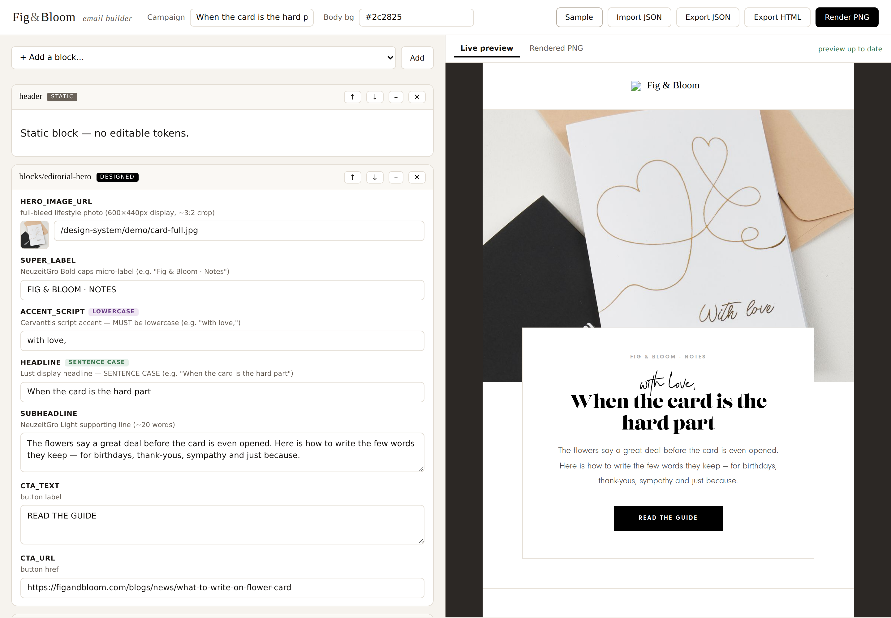

# Fig & Bloom — Email Builder

A local token-editor **UI + render server** for building on-brand Fig & Bloom campaign
emails from the locked design-system templates. Pick blocks, fill their tokens in a form
that **generates itself from the templates**, watch a live preview, then rasterise a
production-accurate PNG with Puppeteer — the same pipeline the campaigns ship through.



## Why this instead of a drag-and-drop builder
The design system has three hard constraints generic builders (Unlayer / GrapesJS / Stripo /
MJML) fight: **custom fonts** (Cervanttis / Lust / NeuzeitGro), **designed blocks that must be
rasterised to PNG** (rotate/overlap/script-over-serif don't survive as live email HTML), and
**locked palette presets + case rules**. This tool is built around those constraints instead
of against them, and the form **auto-syncs** with the templates because every token is already
self-described in each template's `<!-- COMPONENT … TOKENS: … -->` header.

## Quick start
```bash
npm install        # installs puppeteer (downloads a Chromium)
npm start          # serves http://localhost:4321
```
Then open <http://localhost:4321>, click **Sample** to load the “When the card is the hard
part” campaign, and start editing.

> If you already have a system Chromium, set `CHROMIUM_PATH=/path/to/chromium` to skip the
> puppeteer download (`PUPPETEER_SKIP_DOWNLOAD=1 npm install`).

## Deploy to Render.com
The repo ships a `Dockerfile` (Node + system Chromium) and a `render.yaml` Blueprint, so the
PNG renderer works in the cloud with no code changes. Render injects `$PORT` automatically.

[](https://render.com/deploy?repo=https://github.com/dgroch/my-email-builder)

1. Push this folder to your GitHub repo (see below) — Render deploys from Git.
2. In Render: **New → Blueprint**, pick the repo. `render.yaml` is auto-detected (free plan,
   Docker, health check `/`). Click **Apply**.
3. First build takes a few minutes (it installs Chromium). You get a public `*.onrender.com` URL.

Notes: the **free** plan spins the service down after inactivity, so the first hit after idle
is a slow cold start — fine for an internal tool. Unlike a sandboxed environment, Render has
normal outbound internet, so the PNG renderer loads your CDN product images correctly.

To get the code into your repo first:
```bash
unzip my-email-builder.zip && cd my-email-builder
git init && git add . && git commit -m "Fig & Bloom email builder"
git branch -M main
git remote add origin https://github.com/dgroch/my-email-builder.git
git push -u origin main
```

## What it does
- **Auto-generated forms** — fields, help text, palette-preset dropdowns, layout-lever
  enums and `lowercase` / `Sentence case` chips are all parsed from the template headers +
  `design-system/manifest.json`. Add a new template and it appears automatically.
- **Live preview** — assembles the real shell (fonts embedded) and shows it in an iframe.
- **Render PNG** — rasterises designed blocks exactly like the production `slice.js`.
- **Slices** — rasterises **one PNG per block** and bundles them as a `.zip`, so you can drop
  each block into its own Klaviyo image block (each with its own link/alt) instead of pasting
  one giant PNG.
- **Push to Klaviyo** — creates a **draft** campaign in Klaviyo straight from the builder
  (template + campaign + message, all draft — nothing is ever sent).
- **Case validation** — warns + one-click fixes Cervanttis/Lust case violations as you type.
- **Import / Export** — round-trip a `campaign.json`, or export the assembled HTML.

## Layout
```
server.js                 zero-dependency HTTP server (UI + /api/{schema,assemble,render,render-slices,export,klaviyo-draft})
lib/parseTemplates.js     derives the token schema from templates + manifest
lib/render.js             assembles the shell and rasterises (full PNG + per-block slices) via Puppeteer
lib/klaviyo.js            pushes the assembled HTML to Klaviyo as a draft campaign
public/                   editor UI (index.html, app.js, style.css)
design-system/            bundled copy of the template library, shells, fonts, assets, manifest
```

## API
| Method | Path | Body | Returns |
|---|---|---|---|
| GET  | `/api/schema`   | — | components + tokens (types, presets, case rules), ordering & token rules |
| POST | `/api/assemble` | `{campaign}` | `{html, unfilled}` — assembled preview HTML |
| POST | `/api/render`   | `{campaign}` | `{pngBase64, brokenImages, height}` |
| POST | `/api/render-slices` | `{campaign}` | `{slices:[{index, component, width, height, pngBase64}], brokenImages}` |
| POST | `/api/export`   | `{campaign}` | `{html, unfilled, campaign}` (HTML keeps `{{ASSETS_BASE}}` + Klaviyo tags) |
| POST | `/api/klaviyo-draft` | `{campaign, listId, fromEmail, fromLabel?, replyToEmail?, subject?, previewText?}` | `{campaignId, messageId, templateId, editUrl}` |

A `campaign` is `{ campaignName, bodyBg, blocks:[{ component, tokens:{…}, palette? }] }`.

## Production handoff
The exported HTML keeps `{{ASSETS_BASE}}` and the footer's Klaviyo merge tags. To ship:
upload the rasterised PNGs of designed blocks to the Klaviyo media library, swap the
`design-system/assets` line-art for hosted URLs, and use `design-system/shell/shell-production.html`.

## Slices (one PNG per block)
The **Slices** tab rasterises every block to its *own* PNG instead of one tall image. Click
**Render slices** to preview them, then **Download all (.zip)** for a `…-slices.zip` of
`01-header.png`, `02-blocks-editorial-hero.png`, … (numbered in send order). Drop each PNG into
its own Klaviyo image block so every section keeps its own click-through URL and alt text — the
classic "sliced email" build, but generated for you. The zip is built in the browser (no extra
dependency); the PNGs are 2× for retina.

## Push draft to Klaviyo
The **Push to Klaviyo** button creates a **draft** campaign in your Klaviyo account — it never
sends. Under the hood it (1) creates a `CODE` template from the assembled HTML, (2) creates a
draft campaign with one email message, and (3) assigns the template to that message. You then
finish/schedule/send it inside Klaviyo.

Setup:
1. Create a Klaviyo **private API key** with `campaigns:write` + `templates:write` scopes.
2. Give it to the **server** as an env var (never the browser): `KLAVIYO_API_KEY=pk_xxx`.
   On Render, add it under the service's *Environment*. Optionally pin `KLAVIYO_REVISION`
   (defaults to a recent stable revision).
3. In the dialog, fill the **audience** (a Klaviyo list or segment ID), **from email**, and
   optionally from-label / reply-to / subject / preview text. Audience + sender are remembered
   in your browser's localStorage for next time.

Notes: the draft's `{{ASSETS_BASE}}` is pointed at *this server's* public URL so the line-art
assets resolve from Klaviyo's side — so push from the deployed (Render) instance, not localhost,
if you want those images to load. Product images already use absolute CDN URLs. For a fully
hand-tuned build, the **Slices** workflow above gives you per-block PNGs to place manually.

## Generating campaigns in future (and the "email builder skill")
This interface is **template-driven**, not an exporter you upload *into*. The campaign you build
here *is* a `campaign.json` — `{ campaignName, bodyBg, blocks:[{ component, tokens, palette? }] }`.
So the round-trip for future campaigns is:

- **By hand:** build in the UI → **Export JSON** to save it, **Import JSON** to reload/iterate.
- **With the creative email-campaign-builder skill:** that skill writes the *same* `campaign.json`
  shape against these components/tokens. Have it emit a `campaign.json`, then **Import JSON** here
  to preview, render PNGs/slices, or push the draft to Klaviyo. It does **not** export a special
  proprietary file — the `campaign.json` *is* the interchange format, and the form auto-syncs to
  whatever components/tokens exist in `design-system/`. (See `/api/schema` for the current list of
  components and their tokens, which is exactly what the skill should target.)

## Note on sandboxed environments
If Puppeteer renders show remote images as “broken”, the host is blocking Chromium's outbound
network. On a normal machine (and in every browser live-preview) the CDN images load fine; the
local line-art assets always resolve via `file://`.

## Keeping the design system in sync
`design-system/` is a bundled copy of `creative-email-campaign-builder/references/`
(templates, shells, assets, manifest). Re-copy that folder to pick up template changes.
