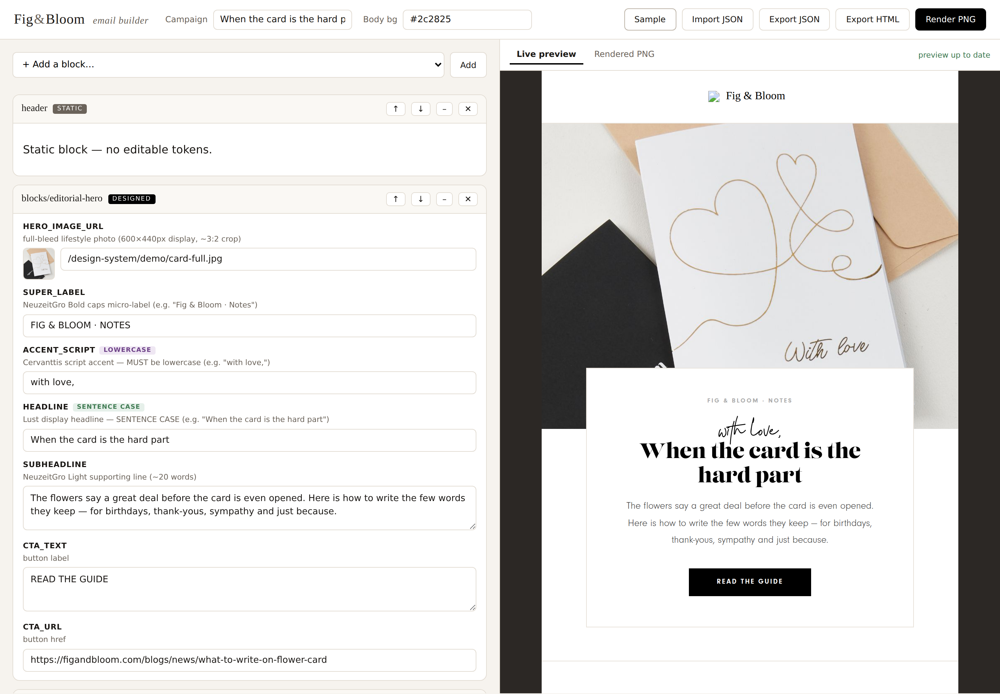

# Fig & Bloom — Email Builder

A local token-editor **UI + render server** for building on-brand Fig & Bloom campaign
emails from the locked design-system templates. Pick blocks, fill their tokens in a form
that **generates itself from the templates**, watch a live preview, then rasterise a
production-accurate PNG with Puppeteer — the same pipeline the campaigns ship through.



## Why this instead of a drag-and-drop builder
The design system has three hard constraints generic builders (Unlayer / GrapesJS / Stripo /
MJML) fight: **custom fonts** (Cervanttis / Lust / NeuzeitGro), **designed blocks that must be
rasterised to PNG** (rotate/overlap/script-over-serif don't survive as live email HTML), and
**locked palette presets + case rules**. This tool is built around those constraints instead
of against them, and the form **auto-syncs** with the templates because every token is already
self-described in each template's `<!-- COMPONENT … TOKENS: … -->` header.

## Quick start
```bash
npm install        # installs puppeteer (downloads a Chromium)
npm start          # serves http://localhost:4321
```
Then open <http://localhost:4321>, click **Sample** to load the “When the card is the hard
part” campaign, and start editing.

> If you already have a system Chromium, set `CHROMIUM_PATH=/path/to/chromium` to skip the
> puppeteer download (`PUPPETEER_SKIP_DOWNLOAD=1 npm install`).

## Deploy to Render.com
The repo ships a `Dockerfile` (Node + system Chromium) and a `render.yaml` Blueprint, so the
PNG renderer works in the cloud with no code changes. Render injects `$PORT` automatically.

[](https://render.com/deploy?repo=https://github.com/dgroch/my-email-builder)

1. Push this folder to your GitHub repo (see below) — Render deploys from Git.
2. In Render: **New → Blueprint**, pick the repo. `render.yaml` is auto-detected (free plan,
   Docker, health check `/`). Click **Apply**.
3. First build takes a few minutes (it installs Chromium). You get a public `*.onrender.com` URL.

Notes: the **free** plan spins the service down after inactivity, so the first hit after idle
is a slow cold start — fine for an internal tool. Unlike a sandboxed environment, Render has
normal outbound internet, so the PNG renderer loads your CDN product images correctly.

To get the code into your repo first:
```bash
unzip my-email-builder.zip && cd my-email-builder
git init && git add . && git commit -m "Fig & Bloom email builder"
git branch -M main
git remote add origin https://github.com/dgroch/my-email-builder.git
git push -u origin main
```

## What it does
- **Auto-generated forms** — fields, help text, palette-preset dropdowns, layout-lever
  enums and `lowercase` / `Sentence case` chips are all parsed from the template headers +
  `design-system/manifest.json`. Add a new template and it appears automatically.
- **Live preview** — assembles the real shell (fonts embedded) and shows it in an iframe.
- **Component library** (the **Library** tab) — every component rendered *alive* with on-brand
  sample data (no fields to fill), with live **palette + lever** switching, a **variant-compare**
  strip (all palette presets / lever options side-by-side), search/filter (group, objective,
  designed-only, drafts-only), per-component intent, **Add to campaign** (drops the block into
  the builder's campaign with your chosen palette/levers), **Copy JSON**, and a **Coverage & gaps**
  lens that maps objectives → components and surfaces DRAFT blocks, missing intent and orphans
  to drive new/extended components. Sample data is the single source of truth in
  `lib/sampleData.js` (the test suite asserts every component renders a clean, fully-filled sample).
- **Render PNG** — rasterises designed blocks exactly like the production `slice.js`.
- **Slices** — rasterises **one PNG per block** and bundles them as a `.zip`, so you can drop
  each block into its own Klaviyo image block (each with its own link/alt) instead of pasting
  one giant PNG.
- **Push to Klaviyo** — creates a **draft** campaign in Klaviyo straight from the builder
  (template + campaign + message, all draft — nothing is ever sent).
- **Saved designs** — **Save** a design to the server and reopen, **clone** or delete it later
  from **My designs**. Click a block in the preview to jump to its card on the left.
- **Case validation** — warns + one-click fixes Cervanttis/Lust case violations as you type.
- **Design Studio** (the **Studio** tab, `/studio`) — a visual authoring surface for the component
  library itself: create and upgrade components on a 600px canvas, edit the brand primitives, and
  define reusable campaign layouts. See *The Studio* below.
- **Import / Export** — round-trip a `campaign.json`, or export the assembled HTML.

## Layout
```
server.js                 zero-dependency HTTP server (UI + /api/{schema,assemble,render,render-slices,export,klaviyo-draft,designs})
lib/parseTemplates.js     derives the token schema from templates + manifest
lib/render.js             assembles the shell and rasterises (full PNG + per-block slices) via Puppeteer
lib/glyphs.js             reads the brand faces' cmaps (sfnt + WOFF2); reports characters a face cannot set
scripts/check-fonts.js    fetches every production @font-face URL and audits what comes back
lib/klaviyo.js            pushes the assembled HTML to Klaviyo as a draft campaign
lib/db.js                 Postgres pool + the schema it owns (used when DATABASE_URL is set)
lib/recordStore.js        one collection API over two drivers (Postgres / local-disk JSON)
lib/designs.js            designs backend: local-disk JSON store (last-resort fallback)
lib/designsPg.js          designs backend: Postgres (used when DATABASE_URL is set)
lib/notionStore.js        designs backend: Notion database store (used when NOTION_TOKEN is set)
lib/compileComponent.js   Studio: canvas document → a real design-system template
lib/componentStore.js     Studio: authored components, immutable versions, publish/unpublish
lib/templateSource.js     resolves a component name → template HTML (pin > authored > disk)
lib/brandTokens.js        Studio: brand primitives (palette, type ramp) + override layer
lib/layoutStore.js        Studio: authored campaign layouts (structure, no copy)
public/                   editor UI (index.html, app.js, style.css)
public/studio.*           the Design Studio (authoring canvas, brand editor, layouts)
design-system/            bundled copy of the template library, shells, fonts, assets, manifest
```

## API
| Method | Path | Body | Returns |
|---|---|---|---|
| GET  | `/api/schema`   | — | components + tokens (per-token `type`, `font`, `case`, presets, defaults), per-component **intent** metadata, a `draft` flag, ordering & token rules, and the campaign **objectives** taxonomy |
| GET  | `/api/gallery`  | — | `{components:[{name, group, designed, static, draft, sampleTokens, variants}]}` — every component with a complete set of on-brand **sample tokens** + its variant axes (palette presets + first enum lever). Powers the interactive **component library** |
| POST | `/api/assemble` | `{campaign, markBlocks?, production?}` | `{html, unfilled, validation}` — assembled preview HTML with **absolute** asset URLs (`markBlocks` adds `data-eb-block` anchors; `production` keeps the real Klaviyo merge tags instead of the readable preview substitutions); `validation` is the structured report (see `/api/validate`) |
| POST | `/api/validate` | `{campaign}` | `{ok, errorCount, warningCount, blocks, issues}` — actionable validation **without rendering** (unknown/bare component → group-prefixed suggestion, casing violations, unfilled tokens, off-list **enum** values, and a campaign-level **unsubscribe** assertion) |
| POST | `/api/render`   | `{campaign}` | `{pngBase64, brokenImages, missingGlyphs, height}` — `missingGlyphs` names any character the brand face that typesets it cannot actually set (see **Glyph coverage**) |
| POST | `/api/render-slices` | `{campaign}` | `{slices:[{index, component, width, height, pngBase64, link, keepHtml}], brokenImages}` |
| POST | `/api/export`   | `{campaign, previewText?}` | `{html, unfilled, validation, campaign, missingGlyphs}` — **production** HTML: **resolves `{{ASSETS_BASE}}` to the served URL** (same as `/api/assemble`) and keeps the real Klaviyo merge tags, including the footer's literal ``; `previewText` is baked in as a hidden preheader. Wrapped in **`shell-production.html`** (CDN fonts, light-only) — not the preview shell, whose base64 fonts push the document past Gmail's clip. Returns **422 `UNRESOLVED_TOKENS`** rather than HTML with a hole in it, and **422 `UNREACHABLE_ASSET_BASE`** when the asset URLs it would bake in resolve only on this network (see `PUBLIC_ASSETS_BASE`) |
| GET  | `/api/klaviyo-audiences` | — | `{lists:[{id,name}], segments:[{id,name}]}` for the audience picker |
| POST | `/api/klaviyo-draft` | `{campaign, listId, fromEmail, subject, previewText, fromLabel?, replyToEmail?, links?, designId?}` | `{campaignId, messageId, templateId, editUrl, sliceCount}` — draft built from uploaded per-block slices. **`subject` + `previewText` are required** (400 without them; a `designId` whose saved design carries `subjectLine`/`previewText` satisfies them) — the preview text is baked into the HTML preheader, since Klaviyo doesn't inject `preview_text` into CODE templates |
| GET  | `/api/examples` | `?objective=` (optional) | `{examples:[…]}` — approved exemplars (designs flagged `isExample` + committed seeds), each with full `campaign` + metadata |
| GET  | `/api/designs`        | — | `{designs:[{id, name, createdAt, updatedAt, isExample, objective, approvalStatus, componentsUsed, …}]}` (metadata only) |
| POST | `/api/designs`        | `{name?, campaign, …metadata}` | the saved design (incl. metadata) |
| GET  | `/api/designs/:id`    | — | the full saved design |
| PUT  | `/api/designs/:id`    | `{name?, campaign?, …metadata}` | the updated design |
| POST | `/api/designs/:id/clone` | `{name?}` | a new design copied from `:id` (starts as a fresh draft, not an example) |
| DELETE | `/api/designs/:id`  | — | `{ok:true}` |
| GET  | `/api/studio/components` | — | `{components:[…authored…], shipped:[…]}` — the Studio's component list |
| POST | `/api/studio/components` | `{title, group, mode, slug?, shadowsShipped?}` | a new authored component (status `draft`) |
| GET/PUT/DELETE | `/api/studio/components/:id` | `{doc?, title?, …}` | read / autosave the canvas document / archive |
| POST | `/api/studio/components/:id/version` | `{note}` | cut an **immutable** version from the current document (400 if the compiler reports errors) |
| POST | `/api/studio/components/:id/submit` | `{note}` | mark it `in_review` |
| POST | `/api/studio/components/:id/publish` | `{version}` | publish that version — from here campaigns resolve it |
| POST | `/api/studio/components/:id/unpublish` | — | withdraw it; a shadowed shipped template takes over again |
| POST | `/api/studio/compile` | `{doc, meta}` | `{html, tokens, sampleTokens, warnings, errorCount}` — compile without saving (powers the live guardrail panel) |
| POST | `/api/studio/preview` | `{doc, meta, tokens?}` | the working canvas assembled through the **real** preview pipeline |
| GET  | `/api/studio/fonts.css` | — | the four brand faces, base64-embedded, so the canvas renders in real type |
| GET/PUT | `/api/studio/brand` | `{colours?, typeScale?, bodyBackground?}` | brand primitives (merged baseline + overrides) |
| POST | `/api/studio/brand/reset` | — | drop every override, back to the shipped values |
| GET  | `/api/studio/brand/affected` | `?key=clay` | `{components:[…]}` — the blast radius of a palette change |
| GET/POST | `/api/studio/layouts` | `{name, objective, blocks}` | authored campaign layouts |
| GET/PUT/DELETE | `/api/studio/layouts/:id` | — | one layout; `…/:id/campaign` opens it as a campaign skeleton |

A `campaign` is `{ campaignName, bodyBg, blocks:[{ component, tokens:{…}, palette? }] }`.

### Token defaults

A component may declare `token_defaults` in `design-system/manifest.json` (e.g.
`sections/three-column-steps-*` → `PADDING_TOP`/`PADDING_BOTTOM` at `48px`,
`blocks/polaroid-collage` → `40px`/`50px`, `blocks/comparison-vs` → `LEFT_TREATMENT: "none"`).
A token with a default is **optional**: omit it, or leave it blank, and assembly fills the
default in rather than emitting a literal `{{TOKEN}}` — which would otherwise land inside a CSS
declaration and silently break the rule. `/api/schema` surfaces it as `default` on the token,
`/api/validate` doesn't report it as unfilled, and the builder seeds the field with it. This is
what makes it safe to add a new lever to an existing component without breaking saved campaigns.

### Compliance gates in `/api/validate`

Two assertions fail a campaign outright, so nothing depends on a human noticing:

- **Unsubscribe** — the campaign's assembled *production* HTML must carry ``
  (the `footer` component) or `{{ unsubscribe_url }}` (`sections/opt-out`). Klaviyo does **not**
  inject an unsubscribe link into a `CODE`-editor template, so a campaign without one is
  non-compliant on send. Issue type `missing_unsubscribe`. Pass `{ requireUnsubscribe: false }`
  to `validateCampaign()` when validating a single component in isolation (the library samples).
- **Locked enums** — every enum token (`ACCENT_ILLO`, `ROTATION`, `DENSITY`, `TYPE_SCALE`,
  `IMG_SIDE`, `IMG_HEIGHT`, `LEFT_TREATMENT`) rejects any value outside its options, including a
  blank or wrong-cased one. The levers drive CSS class names (`illo-{{ACCENT_ILLO}}`), so an
  off-list value used to match no rule and read as "off" — a silent no-op. Issue type
  `invalid_enum`, carrying `options` and a suggested value.
- **Unsettable glyphs** — a character the face that typesets the token maps onto a different
  letter fails the campaign (`unsupported_glyph`). See **Glyph coverage** below: this is the one
  defect class where the render looks correct and the copy is wrong.
- **Duplicate logo bar** — `heroes/hero-b-white|clay|noir` draw their **own** logo bar, tinted to
  the band colour, so they take the place of `header`. Putting `header` in front of one renders
  two Fig & Bloom logo bars about 60px apart. Issue type `duplicate_logo_bar`; the fix is to drop
  the `header` block. This is the one documented exception to "`header` ← always first", and it
  is recorded in `orderingRules.header_replacing_heroes`. The logo bar is deliberate, not an
  oversight: every saved design that uses a hero-b variant places it at index 0 with no header
  and depends on it.

### Per-token font, and why the casing rule follows it

`/api/schema` returns, on every token: `type` (`text` / `url` / `image` / `length` / `palette` /
`enum`), `font` (`cervanttis` / `lust` / `neuzeitgro`, or absent where the token never reaches
type), and `case` (`lower` / `sentence` / `any`).

The casing rule follows the **face**, not the token name, and the face is read off the template
body rather than off prose in the header comment. `HEADLINE` is Cervanttis in the heroes and Lust
in the products; a flat map keyed by token name cannot say that, which is why the global
`tokenRules` map is now a deprecated fallback rather than the source of truth. Defaults per face:
Cervanttis → `lower` (it is a script face, set lowercase throughout the brand), Lust → `sentence`,
NeuzeitGro → `any` (it carries `text-transform:uppercase` at every size it is used, so the
authored casing does not reach the reader). A token's own description still wins where it states
a rule explicitly.

If you are adding a token to a template, note that its description must stay **on its own line**.
A token documented with no description used to swallow the following line, so `SUPER_LABEL` in
`heroes/hero-c1` inherited `HEADLINE`'s "MUST be lowercase" — the phantom rule that made
lowercase-`SUPER_LABEL` discoverable only by submitting and reading the error — and consumed
`{{HEADLINE}}` on the way, so `HEADLINE` lost its real rule at the same time.

### Glyph coverage: the failure that does not look like one

`POST /api/render` returns `missingGlyphs` alongside `brokenImages`:

```json
{ "component": "heroes/hero-a", "index": 0, "token": "HEADLINE", "face": "cervanttis",
  "char": "ø", "codepoint": "U+00F8", "kind": "folded", "rendersAs": "o",
  "message": "'HEADLINE' contains ø (U+00F8), which cervanttis maps to its base glyph — it renders as o, silently changing the word." }
```

Two kinds are reported. `missing` is the ordinary case: the codepoint is absent, the client
substitutes another face, and the mismatch is visible. `folded` is the dangerous one: the cmap
maps the codepoint to its **unaccented base glyph**, so the mark simply disappears and the text
sets cleanly as a different word. Nothing errors, `document.fonts.check()` returns true, and no
fallback face appears — which is how one send spelt a maker's name two different ways, `ØKAR` in
NeuzeitGro and `Okar` in Cervanttis, and passed review.

**Current state of the three faces** — run `npm run check:fonts`:

| Face | Loads? | Folds onto base glyph | Verdict |
|---|---|---|---|
| Lust | yes | — | clean; it renders `Ø` correctly |
| NeuzeitGro | yes | — | clean, full Latin-1 |
| Cervanttis | yes | all 48 accented Latin-1 letters (`Ø ø Ã ã Í í Î î É é Ç Å å Ñ ñ …`) | **needs re-cutting** |

The Cervanttis fault is in the font binary, which is hosted outside this repo. It is not a
mapping mistake to be corrected — the face has **123 glyphs and no diacritic marks at all**, so
there is nothing to compose accented letters from. Someone pointed the accented codepoints at
the bare letters so they would not render as tofu boxes. Fixing it properly means drawing new
glyphs, which is type-design work on a licensed face.

**So the rule is: do not set accented copy in Cervanttis, and `/api/validate` enforces it.**
A folded character is an `unsupported_glyph` **error** — the campaign does not validate, because
the word would ship misspelt and nothing in a render review would show it. A merely absent
character is a warning: the client substitutes another face, which is ugly but still says what
the author wrote. The issue names the character, what it would actually render as, and which
brand faces do set it; it never offers to "fix" the value by stripping the mark, because that is
the same misspelling written down deliberately. Move the copy to a Lust or NeuzeitGro token
instead — both cover Latin-1 in full.

Cervanttis's diaeresis set (`Ä Ë Ï Ö Ü ä ë ï ö ü`) is genuine, so `Mörk`, `Zürich` and `Käse`
are safe and are not flagged. The acute, grave, circumflex, tilde, ring, cedilla and slash sets
are not. `/api/schema` publishes the per-face lists as `fontCoverage`, and the builder reads
them to warn on the field as you type — so the editor and the validator cannot disagree.

`lib/glyphs.js` reads the cmaps straight out of the preview shell's embedded faces, so
`/api/render` audits the exact bytes the renderer rasterises with. It also parses **WOFF2**,
which is what the production shell links, so `npm run check:fonts` audits the faces a *sent*
email will actually load — see below.

### `npm run check:fonts`

Fetches every `@font-face` URL in `shell-production.html` and reports, per face: whether it
loads at all, whether its cmap folds any accented letter onto its base glyph, and whether the
bytes match the declared `format()`. It is a separate networked command rather than part of
`npm test` on purpose — a suite that fails when a CDN hiccups is a suite people learn to ignore.

Run it after touching the shell's font block, and on a schedule. It exists because **both**
font faults in this system were silent:

- **NeuzeitGro 404'd.** The body face — nearly every word of every send — pointed at
  `NeuzeitGro-Lig.otf` / `-Bol.otf`, which do not exist on the CDN. Nothing errored; the stack
  fell through to Gill Sans (also 404) and then to Calibri. Fixed: the faces are hosted as
  `.woff2` and the shell now points at them.
- **Gill Sans never existed.** Three more 404s on every open, buying nothing. The `@font-face`
  rules are gone; `'Gill Sans','Gill Sans MT'` stay in the templates' fallback *stack*, where
  they are a system face on macOS/iOS and are the part that was doing the work. Re-hosting it is
  a licensing question (Monotype), not a code change.
- **Cervanttis loads and lies.** See above.

### CSS lengths

`PADDING_TOP`, `PADDING_BOTTOM` and `BTN_WIDTH` are typed `length`. A **bare number** is a unit
slip with an unambiguous intent, so assembly coerces `"40"` to `"40px"` and `/api/validate`
reports it as a `coerced_length` **warning** — the value renders correctly either way, so
rejecting it outright was pointlessly strict. Anything that is not a length at all is still an
`invalid_length` error.

`BTN_WIDTH` also accepts **`"auto"`**, which sizes the button to its own label. It only ever
affects Outlook: the Word renderer cannot shrink-wrap a VML roundrect, so `auto` is resolved at
assembly to a real px width estimated from the label, while every other client shrink-wraps the
live `<a>` regardless. `auto` is a width keyword and stays rejected on the padding tokens.

### Casing is Unicode-aware

Case checks use `\p{Lu}` / `\p{Ll}` with the `u` flag, not `[A-Z]` / `[a-z]`. `Ø` is an
uppercase letter, so `"Økar Bitter Aperitivo"` is correct Sentence case and passes; under an
ASCII test it was read as all-lowercase and rejected, and the repair walked to the first
`[A-Za-z]`, stepped straight over the `Ø`, and proposed `"ØKar"`. A suggestion now uppercases the
first **cased** character wherever it sits, and is omitted entirely when the value already opens
with a capital. The builder's client-side check (`public/app.js`) uses the same rule, so the two
never disagree.

### Inline formatting in token values

Text tokens accept a tiny inline-markdown subset so you can emphasise words — e.g. make
bouquet names bold — without touching templates: `**bold**`, `*italic*`, and
`[text](https://link)`. Escape a literal marker with a backslash (`\*`). Formatting renders in
visible text and in the rasterised PNG/Klaviyo output, but is automatically flattened to plain
text where a token feeds an HTML attribute (e.g. image `alt`). The schema marks which tokens
support it with `markdown: true` (text tokens only — not URLs, colours, or enum levers), and the
builder shows a **markdown** chip on those fields. See `lib/markdown.js`.

### Agent-facing metadata

`/api/schema` carries two additive layers that help an agent reason about component choice
from the contract itself (sourced from the shared table in `lib/componentStrategy.js`, the
builder-side mirror of `references/component-strategy.md` in `dgroch/skills` — keep the two in
sync):

- **Per-component intent** — optional `bestFor` / `avoidFor` (objective ids), `visualRole`,
  `requiresImage`, `imageRatio`, `tone`. Components without an entry simply omit these keys.
- **`objectives`** — the canonical campaign-objective taxonomy (`farewell_sellthrough`,
  `range_launch`, …, plus the recurring `editorial_digest` monthly newsletter) with a
  recommended block sequence, hero options, proof modules, CTA style, urgency, modules to
  avoid, and a set of restrained `subjectPatterns` (subject-line templates) per objective.

**Design metadata** (persisted on every saved design, parity across the disk + Notion
backends): `isExample`, `objective`, `campaignType`, `audienceAwareness`, `primaryCTA`,
`subjectLine`, `previewText`, `emotionalTone`, `approvalStatus` (`draft`|`approved`|`sent`),
`componentsUsed` (derived), `sourceBriefLink`, `klaviyoLink`, `resultNotes`. Flag a design
`isExample:true` to surface it through `/api/examples`. The persisted `subjectLine` /
`previewText` are used as the fallback subject/preview when `/api/klaviyo-draft` is called
without them — and since the push now **requires** both lines, a design saved with them is
pushable by `designId` alone. See *Saving designs* for how the Notion backend stores these.

> **Note — `/api/agent-contract` was intentionally not built.** The execution contract is
> `/api/schema` (now including intent + objectives) and the workflow rules live in the skill;
> a second contract source would only add drift risk. See `docs/backend-tasks.md`.

## The Studio — authoring components visually

`/studio` (the **Studio** tab) is the authoring surface for the component library itself. It exists
so a designer who is not a developer can create, upgrade and publish components without touching
the repo, a template file or a manifest entry.

### The idea that makes it work

An authored component **compiles to an ordinary design-system template** — table HTML with
`{{TOKEN}}` slots behind a leading `<!-- COMPONENT … TOKENS: … -->` header, exactly like a
hand-written one. It is not a parallel format with its own renderer. That single decision is why
`/api/schema`, the auto-generated form, `/api/validate`, the slice pipeline and the Klaviyo push
all handle an authored component with **no code that knows it exists**: `lib/templateSource.js`
answers "what HTML is this component?" and everything downstream just asks it.

### Two modes, drawn along the rasterisation line

The Studio gives different freedom either side of the line where email constraints stop mattering:

| | **Designed block** | **Live HTML** |
|---|---|---|
| Ships as | a PNG slice | real markup |
| Layout | free canvas — absolute position, overlap, rotation | flow only |
| Why | the inbox receives an image, so Outlook's Word engine never sees the CSS | Word *does* lay this out, and merge tags must survive |
| Refuses | a Klaviyo merge tag (every recipient would get a picture of ``) | rotation, overlap, absolute positioning |

The compiler enforces this: rotation in a live-HTML component is a compile **error**, not a silent
no-op, and a merge tag inside a rasterised block is refused outright.

### Invariants the compiler applies, so nobody has to remember them

- **Cervanttis descender padding.** Every script line compiles with `padding-bottom:0.65em`. The
  overlap bug documented further down this README cannot be authored by hand.
- **Locked font stacks.** The designer picks a *type role* (script / display / body / micro), never
  a font stack — a fallback chain is a deliverability decision, not an aesthetic one.
- **Case rules.** A slot on a Cervanttis role declares itself lowercase in its token description, so
  `parseTemplates` reads the rule back and the builder's case validator enforces it. A capital in a
  script line is flagged on the canvas as you type it.
- **Conditional CTAs.** A tokenised button compiles inside `{{#CTA_TEXT}}…{{/CTA_TEXT}}`, so a
  campaign that leaves the label blank drops the button instead of shipping an empty black
  rectangle pointing at a raw `{{CTA_URL}}`.
- **Palette resolution.** Colours resolve through the brand palette; an off-palette hex renders but
  is flagged.

Alt text, canvas overflow, unmarked slots and non-square buttons are surfaced in the same live
guardrail strip under the canvas.

### The Figma path

The designer works in Figma first, so the canvas takes a **reference overlay**: drop a frame
exported from Figma behind the canvas, set its opacity, scale and offset, and build on top of it.
The canvas renders in the **real brand faces** (served base64-embedded from
`/api/studio/fonts.css`, so it does not depend on the CDN being reachable) — a script headline
judged in a fallback serif is not judged at all.

### Draft → review → publish, and why versions are immutable

Nothing an authored component does reaches a campaign until it is **published**.

```
draft ──save──▸ draft ──cut version──▸ v1 ──submit──▸ in_review ──publish──▸ live
                                       │
                                       └── v1 is frozen from here. Editing produces v2.
```

Publishing an edit **appends** a version; it never rewrites one. A campaign records the version it
was built against and resolves it as `blocks/editorial-hero@2`, so publishing v3 today cannot
restyle an email that shipped last month. A component that has ever published is **archived**
rather than deleted, so those pinned versions keep resolving.

### Upgrading a shipped component

The brief is to upgrade the library as well as extend it, so an authored component may **shadow** a
template shipped in the repo: publish `sections/button` from the Studio and it overrides
`design-system/templates/sections/button.html` everywhere. **Unpublish and the shipped file takes
over again** — every upgrade is reversible without a deploy.

Upgrading pre-seeds the new canvas with the existing component's token contract, so the slots that
saved campaigns already reference don't silently disappear.

### Brand primitives

The **Brand** tab edits the palette and type ramp every component inherits. This is the highest
blast-radius surface in the tool, so each swatch reports what it touches (`clay` → 19 shipped
components) *before* the change is saved, and **Reset to shipped** drops every override at once.
The manifest's `locked_styles` remains the baseline, and setting a value back to its baseline
clears the override rather than pinning it.

**A palette edit reaches components that were compiled before it — including the shipped
templates on disk.** That works because a compiled template always speaks the *baseline*
palette, and the override is applied as a single substitution pass over the assembled document
(`brandTokens.applyOverrides`). So one edit restyles the whole library at once, and no immutable
published version ever has to be rewritten for it.

**Type-ramp edits do not work that way.** Font sizes are baked into each compiled template, and
a `px` value carries no marker saying which ramp step produced it, so a type change applies to
components compiled *after* it — cut a new version of a component to pick it up.

Unknown palette keys and non-hex values are rejected rather than written through, so a typo cannot
invent a brand colour that no component references.

### Campaign layouts

The **Layouts** tab records the structural half of a campaign — which blocks, in what order, with
no copy. It extends the objective taxonomy in `lib/componentStrategy.js` at runtime, so a new
structure does not need a deploy.

### Where it is stored

Set **`DATABASE_URL`** and everything the Studio owns — authored components and their version
histories, campaign layouts, brand overrides — lives in Postgres. See *Storage* below.

## Storage

Three backends, selected by environment variable. `GET /api/health` reports which one each
store resolved to, so a misconfigured deployment is visible without reading logs. It also
reports `glyphGate` — whether the fold check in `lib/glyphs.js` actually loaded the brand faces.
That check degrades to silence by design (a malformed font must not take down a render), so a
disarmed guard is indistinguishable from a clean report unless something asks: the server warns
about it at startup, `/api/validate` raises a `glyph_gate_unavailable` warning, and this field
is the machine-readable version.

### Two shells, and which paths use which

`design-system/shell/` holds both. They are not interchangeable, and the difference is invisible
until an email goes out wrong:

| | `shell-preview.html` | `shell-production.html` |
|---|---|---|
| Fonts | embedded as base64 (~263KB) | linked from the CDN |
| `color-scheme` | none | `light`, both metas |
| Size of a typical send | ~300KB | ~45KB |
| Used by | everything that **rasterises** — `/api/render`, `/api/render-slices`, and the Klaviyo push's slicing pass | `/api/export`, and the Klaviyo push's final document |

The rasterising paths need the base64 faces: those are the exact bytes Puppeteer draws with, so
a slice cannot come out in a fallback face because a CDN was slow. Anything **sent** needs the
other one: the preview shell's fonts push the document past Gmail's ~102KB clip *inside the
`<head>`*, so the reader sees "[Message clipped]" and the unsubscribe tag never renders; and with
no `color-scheme` the email inverts in dark mode as a patchwork of designed slices and flipped
live HTML.

`render.assemble()` takes `shell: 'production'` for the second case. It is deliberately separate
from `production: true`, which only means "keep the real Klaviyo merge tags" — the Klaviyo push
needs real tags *and* the preview shell, so one flag cannot serve both.

### Where the images point: `PUBLIC_ASSETS_BASE`

The bundled design-system images need an absolute URL, and the default is derived from the
request's own `Host` header. That is correct for the preview and the rasteriser, which fetch
from whichever host just served them, and wrong for **`/api/export`** and the Klaviyo push,
whose HTML is opened later, by someone else, somewhere else.

Exporting from a local checkout therefore used to bake `http://localhost:4321/…` into the
production HTML: well-formed markup, every token filled, and a dead image in every inbox. Set
`PUBLIC_ASSETS_BASE` to the URL a *recipient* can reach (your CDN, or the deployed app's own
origin) and every surface uses it:

```bash
PUBLIC_ASSETS_BASE=https://cdn.figandbloom.com/email-assets npm start
```

Without it, `/api/export` refuses with **422 `UNREACHABLE_ASSET_BASE`** rather than hand back
HTML whose images only load on the machine that made it — but only when the campaign actually
cites the base, so a campaign whose imagery is all on the CDN exports fine either way. The
preview paths are deliberately not gated.

| Store | Notion | Postgres | Local disk |
|---|---|---|---|
| Saved designs | `NOTION_TOKEN` + `NOTION_DESIGNS_DB` | `DATABASE_URL` | fallback |
| Studio components + versions | — | `DATABASE_URL` | fallback |
| Campaign layouts | — | `DATABASE_URL` | fallback |
| Brand overrides | — | `DATABASE_URL` | fallback |

Designs prefer Notion when it is configured, so an existing Notion deployment keeps working
untouched. Everything else prefers Postgres. With neither set, all of it falls back to JSON
files under `DATA_DIR` — which is what a local checkout uses, and **which is wiped on every
redeploy of a container with no persistent disk**. That is the reason this exists: a designer's
component library cannot live somewhere a deploy erases.

### Postgres

`render.yaml` declares a free managed database and injects its `DATABASE_URL`, so **New →
Blueprint** provisions it with no manual step. Anywhere else, point `DATABASE_URL` at any
Postgres 12+ instance. TLS verification is relaxed for non-local hosts, since managed providers
(Render included) terminate TLS with a certificate that does not chain to the default CA bundle.

The schema in `lib/db.js` is created on boot and is idempotent — safe on every start, and the
single place the shape is declared. Records are stored as `JSONB` with a few columns promoted
out of them (`name`, `status`, `published_version`, `ever_published`, `updated_at`): the JSONB
is the source of truth, and the columns exist so listing is indexed and the data is legible at a
`psql` prompt. Columns added after the first deploy arrive through
`ALTER TABLE … ADD COLUMN IF NOT EXISTS`, because `CREATE TABLE IF NOT EXISTS` is a no-op
against a table that already exists.

### Why there is still an in-memory snapshot

`render.assemble()` resolves a component name to HTML **synchronously**, deep inside a call
stack that is sync all the way down. A database is not. Rather than make assembly async — which
would ripple through the render, slice and Klaviyo paths for no benefit — the published library
is held in memory:

- every write refreshes it immediately, so this instance is never stale to itself;
- each `/api/*` request refreshes it if it is older than `STUDIO_CACHE_MS` (default 5000), which
  bounds how long a *second* instance can serve a library another instance has already changed;
- the snapshot query is narrowed to components with at least one published version
  (`WHERE ever_published`), so drafts and long version histories stay out of the hot path.

If you run more than one instance, `STUDIO_CACHE_MS` is the staleness window to think about.

## Tests
`npm test` (zero-dependency runner). It asserts the two standing guardrails — every
`/api/schema` component `name` resolves to a real template file, and every `isExample` design
assembles with zero `(missing template)` and zero unfilled tokens — plus the intent/objective
table integrity and the validation behaviour.

It also covers the Studio: that a compiled canvas round-trips back through `parseTemplates` as a
first-class component (right field types, right case rules), that the compiler applies the
descender padding and the conditional-CTA wrapper, that its guardrails fire (rotation in live
HTML, merge tag in a raster, missing alt, bad token name, canvas overflow), that published
versions are immutable and version-pinned references keep resolving after a later publish or an
unpublish, that a published upgrade shadows its shipped template and reverts on unpublish, and
that a palette override reaches both a component compiled before the edit and a shipped
template, in one pass that does not cascade when one colour's override is another's baseline.

The Studio suite picks its driver from `DATABASE_URL` exactly as the app does, so:

```bash
npm test                                   # disk driver
DATABASE_URL=postgres://… npm test         # the identical assertions against Postgres,
                                           # plus that writes really land as rows
```

The disk run is pointed at a scratch `DATA_DIR`; the Postgres run truncates its tables at the
start and end, so neither ever touches real designs. **Point it at a scratch database, not a
production one.**

## Saving designs (persistence)
**Save** stores the current design; **My designs** lists them to reopen, **clone**, or delete.
Clicking a block in the live preview scrolls to and highlights its card in the builder. There are
two interchangeable backends (same `/api/designs` API) — the server picks one at startup and logs
which:

### Notion database (recommended — survives redeploys, no paid plan)
Set both env vars and the app stores each design as a page in a Notion database:

- `NOTION_TOKEN` — an **internal integration** secret (create at
  <https://www.notion.so/my-integrations>).
- `NOTION_DESIGNS_DB` — the **Email Designs** database id.

Then **share the database with the integration**: open the database in Notion → `•••` →
*Connections* → add your integration. Each design becomes a row (Name / Updated / Created visible
as properties) with the full campaign JSON stored as chunked ```json code blocks in the page body
(Notion caps a single text run at 2000 chars), followed by a second ```json block holding the
design metadata. Durable across redeploys, and you can browse the designs in Notion. Required
integration capabilities: read + insert + update content.

**Optional native columns.** The metadata always round-trips via the page body, so nothing extra
is required. But if you add matching columns to the database, the metadata is *also* mirrored into
them so designs become filterable/searchable in Notion: `Is Example` (checkbox), `Objective`
(select), `Approval Status` (select), `Campaign Type`, `Audience Awareness`, `Primary CTA`,
`Emotional Tone`, `Components Used` (multi-select), `Source Brief` (url), `Klaviyo Link` (url),
`Result Notes` (rich text). Columns that don't exist are simply skipped.

### Local disk (fallback)
If `NOTION_TOKEN` is unset, designs are written as JSON files under `DATA_DIR` (default `./data`).
On Render this is **ephemeral** unless you add a persistent disk on a paid plan, so designs would be
lost on redeploy — which is why the Notion backend is preferred.

Either way, Export/Import JSON remains the portable, storage-independent backup.

## Production handoff
The exported HTML keeps `{{ASSETS_BASE}}` and the footer's Klaviyo merge tags. To ship:
upload the rasterised PNGs of designed blocks to the Klaviyo media library, swap the
`design-system/assets` line-art for hosted URLs, and use `design-system/shell/shell-production.html`.

## Slices (one PNG per block)
The **Slices** tab rasterises every block to its *own* PNG instead of one tall image. Click
**Render slices** to preview them, then **Download all (.zip)** for a `…-slices.zip` of
`01-header.png`, `02-blocks-editorial-hero.png`, … (numbered in send order). Drop each PNG into
its own Klaviyo image block so every section keeps its own click-through URL and alt text — the
classic "sliced email" build, but generated for you. The zip is built in the browser (no extra
dependency); the PNGs are 2× for retina.

Each slice also shows an editable **Link URL** (pre-filled from the block's tokens). These are the
same per-block links used by **Push to Klaviyo** below, so set them here once. Blocks that stay
live HTML — the unsubscribe footer, and blocks carrying dynamic Klaviyo tags such as the promo-code
box — are flagged as such instead of getting a link field.

**Multi-region blocks:** a block can declare sub-slice regions (a descendant with
`data-eb-slice="…"`, optionally `data-eb-href` / `data-eb-alt`) and then emits *one linked slice
per region* instead of a single image — the regions tile the block's full height so they stack back
seamlessly. `blocks/journal-tile` uses this: it now ships as a header slice plus one slice per
article tile — **linked image rows, not live HTML** — so each tile keeps its own post link while
the whole module renders in brand fonts. Those regions carry fixed per-region links (shown
read-only in the Slices tab), so they aren't part of the editable per-block link overrides.

## Push draft to Klaviyo
The **Push to Klaviyo** button creates a **draft** campaign in your Klaviyo account — it never
sends. The draft is built from **per-block image slices, not one giant PNG**, so each block is its
own image with its own click-through link. Under the hood it:

1. rasterises each block to its own PNG (same engine as the **Slices** tab);
2. uploads each PNG to your Klaviyo **media library** (`POST /api/image-upload`), getting a hosted
   `image_url`;
3. assembles a `CODE` template where every block is a `<tr>` with that hosted image wrapped in its
   own `<a href>` link — with the **preview text baked into a hidden preheader** at the top of the
   body (see below);
4. creates a draft campaign + message and assigns the template.

### Subject + preview text are required (and why the preheader is baked in)

Klaviyo **does not inject** a campaign's `preview_text` field into `CODE`-editor (raw HTML)
templates — that field only feeds Klaviyo's own UI. Mail clients have no "preview text" header
either: the snippet Gmail / Apple Mail show under the subject (and on the lock screen) is just the
**first text they can scrape out of the email body**. A sliced email's first scrapable text is the
first image's `alt` attribute — which is how a sent campaign once shipped with
`blocks/caption-bar-hero` leading its Gmail preview.

The builder therefore:

- **bakes the preview text into the HTML** as a hidden, padded preheader `<div>` (first thing
  inside `<body>`), which is the only mechanism clients actually honour;
- **requires** a subject line and preview text on push — `/api/klaviyo-draft` returns 400 without
  them (the internal campaign name is never used as a fallback subject);
- derives slice `alt` text from the block's **copy tokens** (headline / caption / label), never
  from internal component names.

Klaviyo's `preview_text` field is still set on the message so the Klaviyo UI matches — but the
copy that reaches inboxes is the preheader in the HTML. **If you edit the subject or preview in
Klaviyo afterwards, re-push from the builder** so the baked preheader stays in sync.

Keep the subject's first ~35 characters meaningful (phone notifications truncate around there) and
aim for ~40–90 characters of preview text; the preheader pads the remainder so body text never
trails it.

The **footer stays live HTML** (not an image) so its `` merge tag still works —
rasterising it would break the legally-required unsubscribe link. The **promo-code block stays live
HTML** for the same reason: the code is routinely a `` tag that Klaviyo substitutes
per recipient at send time, and a PNG would ship every recipient the same picture of the literal
tag. (The full list is `assembly.html_only_components` in the manifest.) You then
finish/schedule/send the draft inside Klaviyo.

**Per-block links:** open the **Slices** tab and click **Render slices** first — each image block
gets an editable *Link URL* (pre-filled from its tokens: `CTA_URL` / `PRODUCT_URL` / `HERO_LINK_URL`).
Those overrides are sent with the push, so each block links wherever you want.

Setup:
1. Create a Klaviyo **private API key** with `campaigns:write` + `templates:write` + `images:write`
   (upload the slices) + `lists:read` + `segments:read` (populate the audience picker) scopes.
2. Give it to the **server** as an env var (never the browser): `KLAVIYO_API_KEY=pk_xxx`.
   On Render, add it under the service's *Environment*. Optionally pin `KLAVIYO_REVISION`
   (defaults to a recent stable revision).
3. In the dialog, pick the **audience** from the list/segment dropdown (or paste an ID),
   set the **from email**, the **subject line** and the **preview text** (both required —
   prefilled from the loaded design's saved `subjectLine`/`previewText` when present), and
   optionally from-label / reply-to. Audience + sender are remembered in your browser's
   localStorage for next time.

Note: line-art assets in the slices are baked into the uploaded PNGs, so they don't depend on the
server being reachable. Push from the deployed (Render) instance rather than localhost so Chromium
can load your CDN product imagery while rasterising. For a fully hand-tuned build, the **Slices**
tab also lets you download the PNGs and place them in Klaviyo yourself.

## Generating campaigns in future (and the "email builder skill")
This interface is **template-driven**, not an exporter you upload *into*. The campaign you build
here *is* a `campaign.json` — `{ campaignName, bodyBg, blocks:[{ component, tokens, palette? }] }`.
So the round-trip for future campaigns is:

- **By hand:** build in the UI → **Export JSON** to save it, **Import JSON** to reload/iterate.
- **With the creative email-campaign-builder skill:** that skill writes the *same* `campaign.json`
  shape against these components/tokens. Have it emit a `campaign.json`, then **Import JSON** here
  to preview, render PNGs/slices, or push the draft to Klaviyo. It does **not** export a special
  proprietary file — the `campaign.json` *is* the interchange format, and the form auto-syncs to
  whatever components/tokens exist in `design-system/`. (See `/api/schema` for the current list of
  components and their tokens, which is exactly what the skill should target.)

## Note on sandboxed environments
If Puppeteer renders show remote images as “broken”, the host is blocking Chromium's outbound
network. On a normal machine (and in every browser live-preview) the CDN images load fine; the
local line-art assets always resolve via `file://`.

## Script headlines and descender ink (`padding-bottom:0.65em`)
Cervanttis is a script face whose glyph ink runs far past the bottom of its line box. Measured
against the embedded font, the deepest lowercase descender is `j` at **0.74em** below the
baseline, and the baseline itself sits at `lineHeight/2 + 0.5em` from the top of the line box. So
for a script line the ink overshoots its own box by:

```
overshoot = 0.5em + maxDescent - lineHeight/2      ≈ 0.74em at line-height:1.0
                                                   ≈ 0.77em at line-height:0.95
```

CSS lays the next element out against the **line box, not the ink**, so `margin-bottom` is
measured from a boundary the glyph has already crossed. At `font-size:62px` that put roughly 25px
of headline descender straight through the first line of the paragraph below it — text over text,
on any headline whose last line contains `f g j p q y` (and on capitals, which dive deeper still:
`A` reaches 0.81em).

The fix is `padding-bottom:0.65em` on the script element, inline, alongside its `line-height`.
`em` so it tracks any future `font-size` change — including the mobile `.uh`/`.hh` overrides in
the shell, which shrink these headlines to 28–38px. Leading and `margin-bottom` are untouched, so
multi-line script headlines keep their deliberate tight nesting.

`0.65em` is the middle of a narrow feasible band, both ends measured:

| Bound | Value | Set by |
|---|---|---|
| Floor — ink must clear the next element's box | 0.54em | `blocks/editorial-hero`, whose script line has only a 6px `margin-bottom` to spare |
| Ceiling — content must stay inside the fixed-height hero | 0.69em | `heroes/hero-d-*`, a 500px container with a two-line headline |

Full containment (ink entirely inside the padding box, `margin-bottom` then meaning exactly what
it says) would need 0.78em, which overflows that 500px container. 0.65em leaves the worst-case
lowercase glyph 14–15px clear of the paragraph in the tightest hero, and every fixed-height hero
renders at exactly its declared height.

Applied to the 19 script elements that are followed by flow text: all `heroes/hero-{a,b,c1,c2,d}-*`
headlines, `sections/upsell-noir`, `blocks/{caption-bar-hero,editorial-hero,editorial-collage,story}`,
and `blocks/polaroid-collage`'s `QUOTE_ACCENT`. Deliberately **not** applied where the ink is
already contained: `sections/opt-out` (uses the default `line-height`, whose 1.8em line box
absorbs the descender), the polaroid photo captions (the polaroid frame's own bottom padding
contains them), and `blocks/comparison-vs` (`line-height:54px` on a 24px glyph).

Not covered by this fix: the script **badges and chips** (`blocks/annotated-product`,
`blocks/designed-product-card`, `blocks/offer-panel`) sit on their own coloured pill, and a
descender escapes the pill's background by ~5px. Fixing those means changing each pill's shape,
which is a design call rather than a layout bug.

## The mobile contract (one document, one scale)

An email is a single shrink-to-fit document. A **single** block that cannot go below 600px does
not just break itself — it holds the whole document at 600px, and a phone then scales *every
glyph in the email* by `375/600 = 0.625`. That is why 14px body copy arrived at 8.8px, and why
this is a system-wide contract rather than a per-block nicety.

Three rules, all enforced by `npm test`:

1. **Every 600px structural table carries `.f600`** (or is the root `.ew`). The shell's
   `@media (max-width:600px)` block makes those, and only those, fluid. Forty-five of the
   fifty-three components had never opted in, so the media query had nothing to act on.
2. **Every fixed measure wider than a phone carries `.fm`** — the 552px step rows, the 440px
   body measure, the 380px opt-out measure.
3. **Every full-bleed image carries `.fimg` and an inline `width:100%`**, plus either
   `height:auto` or a **definite** `max-width:600px`.

Rule 3 is the subtle one. An image that has not loaded — a bad URL, or images off, which is how
a great many people read email — takes its intrinsic size from its `width`/`height` attributes.
With a definite CSS height, `width:100%` is then resolved back through that aspect ratio to
600px, which becomes the table's minimum. A **percentage** `max-width` cannot rescue it: against
a shrink-to-fit table it resolves to `none`. So `.fimg` caps at `100vw` — a definite unit —
which lets the image shrink while keeping the crop `IMG_HEIGHT` chose. Clients without `vw`
behave exactly as they did before, so it can only improve on the status quo.

Two-column blocks stack below 600px: `.st-col` (`blocks/story`), `.fl-col`
(`blocks/feature-list`, which carried no classes at all), `.ap-col`
(`blocks/annotated-product`), and `.jt-img`/`.jt-txt` (`blocks/journal-tile`).

**Known limit.** `blocks/polaroid-collage` and `blocks/editorial-collage` cannot reflow: their
cards are absolutely positioned inside a fixed 600px region. On the Klaviyo push they rasterise
to PNG slices that scale as images, which is the shipping path and is fine. In the live-HTML
`/api/export` output they still hold the document at 600px. Do not "fix" this by making the
region fluid — the cards keep their absolute offsets and are simply cropped.

## Keeping the design system in sync
`design-system/` is a bundled copy of `creative-email-campaign-builder/references/`
(templates, shells, assets, manifest). Re-copy that folder to pick up template changes.
